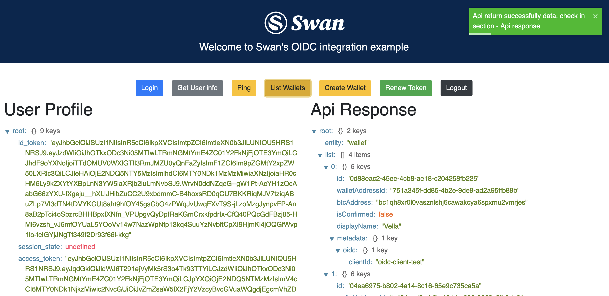

# Swan Bitcoin Integration simulator

> OpenID Connect (OIDC) client with React and typescript

- This is sample application that contains [oidc-client-js](https://github.com/IdentityModel/oidc-client-js) and `React` with `Typescript`.

- The application is based on `create-react-app` - [Create React App](https://github.com/facebook/create-react-app)

# Installation

## Cloning app

- `git clone https://github.com/swan-bitcoin/integration-simulator.git`
- `cd src/`

## Install dependecies

- Install dependecies - `yarn install`

## Running app

- `yarn start` - start the web server that is running on [http://localhost:3000](http://localhost:3000)

## App preview

